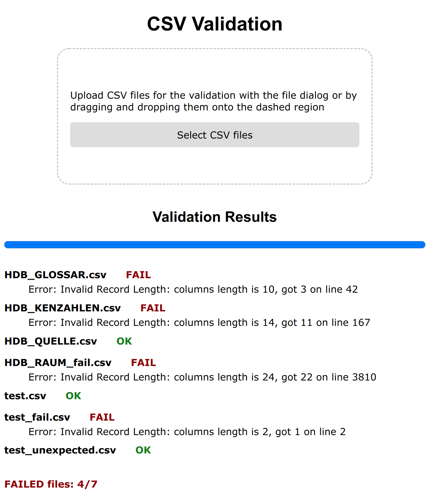

# csv-validate: Validating CSV Parser
This JS CSV validating parser is based on [csv-parse](https://github.com/wdavidw/node-csv-parse) and [csv-sniffer](https://github.com/MonetDBSolutions/npm-csv-sniffer). It features data streaming, error tracing, and automatic identification of the CSV delimiters and quotes.

`csv-validate` provides both NodeJS module (NPM), optional console UI (CLI), and browser/Web UI for the local validation of CSV files.

`\author` Artem Lutov <lua&#64;&#108;utan&#46;ch>  
`\affiliation` [Zazuko GmbH](https://zazuko.com), [Lutov Analytics](https://lutan.ch)  
`\license` [Apache 2](https://www.apache.org/licenses/LICENSE-2.0)  

## Web UI
The Web UI bundle is located in `dist/` and consists of 3 files (and optional `test.csv` example to test the web app):
```sh
dist/
  index.html
  styles.css
  main.js
```

To build the Web UI, just execute `npm run build` from the package directory, producing the `main.js` bundle in `dist/`. Afterward, open `index.html` in your browser to use the web app:


## CLI
Console UI provides the following interface:
```sh
$ npx csv-validate -h
Usage: csv-validate [options] <filename>

Options:
  -r, --relax-column-count   relax column count instead of emitting an error
  -s, --skip-error-lines     skip lines with errors instead of emitting an
                             error
  -d, --delimiter <symbol>   enforce specified CSV delimiter instead of
                             inferring it
  -q, --quotes <l-r-quotes>  left [and right if distinct] quote symbols instead
                             of inferring them (default: "")
  -n, --new-line <string>    enforce specified CSV new line (e.g., \r\n)
                             instead of inferring it
  -e, --encoding <string>    file encoding (default: "utf8")
  -h, --help                 display help for command
```

To install it, execute:
```sh
$ npm install [-g] csv-validate
```
Otherwise, the executable can be called from the package sources as:
```sh
$ bin/csv-validate.js -h
```

Example:
```
$ bin/csv-validate.js test/csv/HDB*.csv

Processing: test/csv/HDB_GLOSSAR.csv
Processing progress: 12 %
inpPartProc()> Inferred delimiter: ,
inpPartProc()> Inferred quoteChar: "
inpPartProc()> Inferred newLine (codepoints):  0xD 0xA
ERROR in test/csv/HDB_GLOSSAR.csv: Error: Invalid Record Length: columns length is 10, got 3 on line 42

Processing: test/csv/HDB_KENZAHLEN.csv
Processing progress: 14 %
inpPartProc()> Inferred delimiter: ,
inpPartProc()> Inferred quoteChar: "
inpPartProc()> Inferred newLine (codepoints):  0xA
Processing progress: 25 %
ERROR in test/csv/HDB_KENZAHLEN.csv: Error: Invalid Record Length: columns length is 14, got 11 on line 167

Processing: test/csv/HDB_QUELLE.csv
Processing progress: 27 %
inpPartProc()> Inferred delimiter: ,
inpPartProc()> Inferred quoteChar: "
inpPartProc()> Inferred newLine (codepoints):  0xD 0xA
Processing progress: 37 %
Completed test/csv/HDB_QUELLE.csv

Processing: test/csv/HDB_RAUM_fail.csv
Processing progress: 41 %
inpPartProc()> Inferred delimiter: ,
inpPartProc()> Inferred quoteChar: "
inpPartProc()> Inferred newLine (codepoints):  0xD 0xA
Processing progress: 55 %
Processing progress: 68 %
Processing progress: 82 %
Processing progress: 95 %
Processing progress: 100 %
ERROR in test/csv/HDB_RAUM_fail.csv: Error: Invalid Record Length: columns length is 24, got 22 on line 3810

CSV Validation Summary:
test/csv/HDB_GLOSSAR.csv    FAIL
    Error: Invalid Record Length: columns length is 10, got 3 on line 42
test/csv/HDB_KENZAHLEN.csv    FAIL
    Error: Invalid Record Length: columns length is 14, got 11 on line 167
test/csv/HDB_QUELLE.csv    OK
test/csv/HDB_RAUM_fail.csv    FAIL
    Error: Invalid Record Length: columns length is 24, got 22 on line 3810
```

## NodeJS Module
The module interface abstracts [csv-parse](https://github.com/wdavidw/node-csv-parse) and [csv-sniffer](https://github.com/MonetDBSolutions/npm-csv-sniffer).

### Interface
The main interface is represented by a single function (see [index.js](index.js): `Parser`):
```js
static import (input: readable-stream.Readable, options: Object)
```
where the possible options are (see [index.js](index.js): `Parser constructor`):
```ts
relaxColumnCount: boolean,  // Default: undefined (false)
skipLinesWithError: boolean,  // Default: undefined (false)
delimiter: string,  // Item delimiter, e.g. ',' or ' '. Default: automatically inferred
quotes: string,  // Item quotation symbol, e.g. '\'' or '"'. Default: automatically inferred
newLine: string  // A record separator, which is a newline character set, e.g., '\n' or '\n\r'. Default: automatically inferred
```

### Usage
The interface can be used as follows:
```js
const CsvValidatingParser = require('csv-validate"')
const { PassThrough } = require('readable-stream')

const input = new PassThrough()
input.write('key1,key2\n')
input.write('value1_1,value2_1\n')
input.write('value1_2,value2_2\n')
input.end()

CsvValidatingParser.import(input, { newLine: '\n' })
```
See [test/interface.test.js](test/interface.test.js) for more examples.
